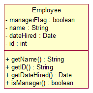

# conditional-logic-refactoring
This exercise deals with refactoring a class to isolate conditional behavior.

The current Employee class (shown below) is used for all employees.  Some employees are managers, as determined by the `isManager` method.  A new requirement is to allow some employees to be part-time.

The obvious quick-and-dirty (and naïve) implementation would be to follow the example for managers and simply add a boolean flag and getter method for part-time employees to the Employee class.  However, this increases the coupling of different behavior to the Employee class.  What's more, the behaviors are probably related to different parts of the company organization - while job titles (like manager) are typically the concern of HR, whether an employee is part or full-time is likely more of a concern to payroll.  These separate parts of the company organization will certainly have different requirements at different times.  Too much coupling of behavior to too few classes can make for a brittle design that is hard to change.
## Design Considerations
In noticing that different parts of an organization are involved here, one should keep [Conway's Law][ecd9770b] in mind - if you make a design that conflicts with the way the organization is structured, you are in for trouble later.  Implementing a design that Separates the behavior of concern to HR from the behavior of concern to payroll will produce a system that is easier to change over time.  Two of the [SOLID principles][304ae1f4] of object-oriented programming can guide the design: the [single responsibility principle][181f7c73] (SRP); and the [open/closed principle][bcf14015] (OCP).

The SRP states that a class should have only one reason to change. This is often interpreted to mean that a class should do only one thing, but [Uncle Bob][d94ac925] points out that "responsibility" in this sense means a responsibility to the owner of the requirements[^1] reflected in the class.  HR and payroll would certainly have different reasons to change the class (in this case HR for titles, payroll for labor categories), which according to SRP implies separate classes.

The OCP states that, once written, a class should not often be updated.  If the code in a class is relatively static over the lifetime of the system, it can be packaged separately, and dependencies (the great booger-boo of object-oriented software) rarely have a need to be updated.  If we separate the concerns of both payroll and HR from the Employee class, the class becomes a pretty basic repository of static data: ID, name, date hired - things that have requirements that are unlikely to change much over time.
## Refactoring To Patterns
Two of the [GoF design patterns][3a10048e] specifically deal with separating conditional behavior into separate new classes: the [decorator](https://en.wikipedia.org/wiki/Decorator_pattern) and [strategy](https://en.wikipedia.org/wiki/Strategy_pattern) patterns.

The decorator pattern wraps around an existing class, mimicking the API of the class.  Because of the shared API, decorators can also wrap other decorators (turtles all the way down), Incrementally adding new behavior.

The strategy class contains one of a specific kind of behavior, and is inserted into the class, which then calls the strategy to execute the behavior. A family of similar behaviors are implemented in separate strategy classes, so the calling class can delegate to whatever strategy was injected.

In the case of job tiles and labor categories, the different behaviors are less a family of similar behaviors than an incremental addition of behaviors to the Employee class. Therefore, the decorator pattern is more appropriate to separate managers and part-time employees.

However, when considering various job titles, manager and staff functionality would represent a family of behaviors, as would full and part-time employees when considering labor category behaviors.  Therefore, within each separate decorator (one for HR job titles, one for payroll labor categories), the injection of distinct strategy classes would be appropriate.  For example, within the JobTitleDecorator, inject ManagerStrategy or StaffStrategy; within the LaborCategoryDecorator, inject FullTimeStrategy or PartTimeStrategy.

  [304ae1f4]: https://en.wikipedia.org/wiki/SOLID "SOLID principles of object-oriented design"
  [ecd9770b]: https://en.wikipedia.org/wiki/Conway%27s_law "Conway's Law"
  [181f7c73]: https://en.wikipedia.org/wiki/Single_responsibility_principle "Single Responsibility Principle"
  [bcf14015]: https://en.wikipedia.org/wiki/Open/closed_principle "Open/Closed Principle"
  [d94ac925]: https://en.wikipedia.org/wiki/Robert_C._Martin "Robert C. Martin"
  [3a10048e]: https://en.wikipedia.org/wiki/Design_Patterns "Design Patterns"
[^1]: https://8thlight.com/blog/uncle-bob/2014/05/08/SingleReponsibilityPrinciple.html
